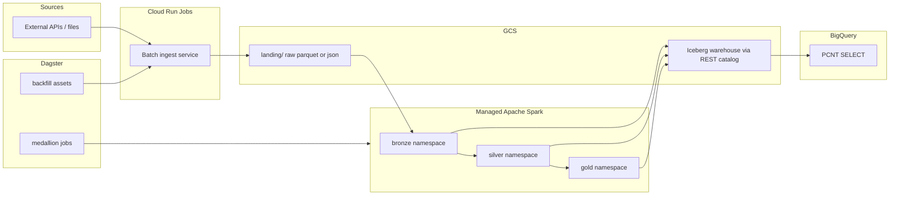

# Platform Architecture: Ingest, Medallion, Orchestration

End-to-end setup for a new GCP project: **Cloud Run** (historical batch ingest) → **Managed Apache Spark** (bronze / silver / gold Iceberg) → **BigQuery** (read-only analytics) → **Dagster** (orchestration).

For the Lakehouse catalog foundation (bucket, REST catalog, IAM), start with [setup.md](../setup.md).

---

## End-to-end flow



| Layer | Who writes | Storage | BigQuery |
| --- | --- | --- | --- |
| **Landing** | Cloud Run | `gs://…/landing/…` (raw files) | No |
| **Bronze** | Spark | Iceberg `bronze.*` | PCNT read |
| **Silver** | Spark | Iceberg `silver.*` | PCNT read |
| **Gold** | Spark | Iceberg `gold.*` | PCNT read |

Spark owns all Iceberg writes. BigQuery reads gold (and lower layers if needed) via:

```sql
SELECT * FROM `PROJECT_ID.CATALOG_ID.gold.fact_equity_daily`;
```

---

## Shared environment variables

Use the same names everywhere (Cloud Run, Spark, Dagster):

```bash
export PROJECT_ID="your-new-project"
export REGION="us-central1"                 # pick one region; co-locate everything
export BUCKET_NAME="your-lakehouse-bucket"
export CATALOG_NAME="${BUCKET_NAME}"
export LANDING_PREFIX="landing"             # gs://${BUCKET_NAME}/${LANDING_PREFIX}/...
export SPARK_DEPS_BUCKET="${BUCKET_NAME}"   # Dataproc batch staging (can be same bucket)
export ARTIFACT_REPO="lakehouse"
```

---

## 1. Foundation (catalog + buckets)

Follow [setup.md](../setup.md) through step 5, then add **Iceberg namespaces** for the medallion:

```bash
for ns in bronze silver gold; do
  gcloud biglake iceberg namespaces create "${ns}" \
    --catalog="${CATALOG_NAME}" \
    --project="${PROJECT_ID}"
done
```

### Recommended GCS layout

Same bucket as the catalog warehouse; keep landing separate from Iceberg table paths:

```text
gs://${BUCKET_NAME}/
  landing/
    source=<source_name>/
      year=2021/month=01/day=15/
        part-0000.parquet
  bronze/          # optional prefix hint; Iceberg metadata lives under catalog paths
  silver/
  gold/
  spark/           # pyspark scripts + job deps uploaded here
    jobs/
      bronze_landing_to_iceberg.py
      silver_curate.py
      gold_aggregate.py
  checkpoints/     # Dagster / backfill state (optional)
    ingest/
```

---

## 2. Enable additional APIs

```bash
gcloud services enable \
  run.googleapis.com \
  artifactregistry.googleapis.com \
  cloudbuild.googleapis.com \
  dataproc.googleapis.com \
  iam.googleapis.com \
  --project="${PROJECT_ID}"
```

---

## 3. Service accounts and IAM

Create three runtime identities (names are suggestions):

```bash
# Cloud Run ingest
gcloud iam service-accounts create sa-ingest \
  --project="${PROJECT_ID}" \
  --display-name="Cloud Run batch ingest"

# Dataproc Serverless (Managed Spark) batches
gcloud iam service-accounts create sa-dataproc-spark \
  --project="${PROJECT_ID}" \
  --display-name="Dataproc Serverless Spark"

# Dagster (agent / Cloud Run / GCE — whatever runs orchestration)
gcloud iam service-accounts create sa-dagster \
  --project="${PROJECT_ID}" \
  --display-name="Dagster orchestrator"
```

### IAM bindings

```bash
INGEST_SA="sa-ingest@${PROJECT_ID}.iam.gserviceaccount.com"
SPARK_SA="sa-dataproc-spark@${PROJECT_ID}.iam.gserviceaccount.com"
DAGSTER_SA="sa-dagster@${PROJECT_ID}.iam.gserviceaccount.com"
BUCKET="gs://${BUCKET_NAME}"

# Ingest: write landing only
gcloud storage buckets add-iam-policy-binding "${BUCKET}" \
  --member="serviceAccount:${INGEST_SA}" \
  --role="roles/storage.objectCreator"

# Spark: read landing + read/write Iceberg files + catalog
gcloud storage buckets add-iam-policy-binding "${BUCKET}" \
  --member="serviceAccount:${SPARK_SA}" \
  --role="roles/storage.objectUser"

gcloud projects add-iam-policy-binding "${PROJECT_ID}" \
  --member="serviceAccount:${SPARK_SA}" \
  --role="roles/biglake.editor"

gcloud projects add-iam-policy-binding "${PROJECT_ID}" \
  --member="serviceAccount:${SPARK_SA}" \
  --role="roles/dataproc.worker"

# Dagster: trigger Cloud Run Jobs + submit Dataproc batches + read checkpoints
gcloud projects add-iam-policy-binding "${PROJECT_ID}" \
  --member="serviceAccount:${DAGSTER_SA}" \
  --role="roles/run.developer"

gcloud projects add-iam-policy-binding "${PROJECT_ID}" \
  --member="serviceAccount:${DAGSTER_SA}" \
  --role="roles/dataproc.editor"

gcloud storage buckets add-iam-policy-binding "${BUCKET}" \
  --member="serviceAccount:${DAGSTER_SA}" \
  --role="roles/storage.objectAdmin" \
  --condition=None
```

Also grant the **Lakehouse catalog service account** `roles/storage.objectUser` on the bucket (see [setup.md](../setup.md) step 4).

---

## 4. Cloud Run: 5-year historical batch ingest

Use **Cloud Run Jobs** (not a long-lived service) for backfill: one execution per date partition, exit when done.

### 4.1 Artifact Registry + build image

```bash
gcloud artifacts repositories create "${ARTIFACT_REPO}" \
  --project="${PROJECT_ID}" \
  --location="${REGION}" \
  --repository-format=docker

gcloud auth configure-docker "${REGION}-docker.pkg.dev"

# From your ingest app directory (Dockerfile required)
docker build -t "${REGION}-docker.pkg.dev/${PROJECT_ID}/${ARTIFACT_REPO}/ingest:latest" .
docker push "${REGION}-docker.pkg.dev/${PROJECT_ID}/${ARTIFACT_REPO}/ingest:latest"
```

### 4.2 Create the job

```bash
gcloud run jobs create equity-ingest-backfill \
  --project="${PROJECT_ID}" \
  --region="${REGION}" \
  --image="${REGION}-docker.pkg.dev/${PROJECT_ID}/${ARTIFACT_REPO}/ingest:latest" \
  --service-account="${INGEST_SA}" \
  --set-env-vars="GCS_BUCKET=${BUCKET_NAME},LANDING_PREFIX=${LANDING_PREFIX},GCP_PROJECT=${PROJECT_ID}" \
  --cpu=2 \
  --memory=4Gi \
  --max-retries=2 \
  --task-timeout=3600
```

### 4.3 Backfill pattern (last 5 years)

Ingest app contract:

- Input env: `START_DATE`, `END_DATE` (or single `PARTITION_DATE=YYYY-MM-DD`)
- Output path (idempotent):  
  `gs://${BUCKET_NAME}/${LANDING_PREFIX}/source=equity/year=YYYY/month=MM/day=DD/`
- Skip write if `_SUCCESS` marker already exists for that partition (safe replays)

Example: run one month at a time from Dagster or a shell loop:

```bash
# Example: one day (Dagster will do this per partition)
gcloud run jobs execute equity-ingest-backfill \
  --project="${PROJECT_ID}" \
  --region="${REGION}" \
  --update-env-vars="PARTITION_DATE=2021-03-15" \
  --wait
```

Shell loop for manual backfill (5 years ≈ 1,825 daily partitions — prefer Dagster):

```bash
START=$(date -v-5y +%Y-%m-%d)   # macOS; on Linux: date -d '5 years ago' +%Y-%m-%d
END=$(date +%Y-%m-%d)
d="${START}"
while [[ "${d}" < "${END}" ]] || [[ "${d}" == "${END}" ]]; do
  gcloud run jobs execute equity-ingest-backfill \
    --project="${PROJECT_ID}" \
    --region="${REGION}" \
    --update-env-vars="PARTITION_DATE=${d}" \
    --wait
  d=$(date -j -v+1d -f "%Y-%m-%d" "${d}" +%Y-%m-%d)
done
```

Store progress under `gs://${BUCKET_NAME}/checkpoints/ingest/` so failed days can be retried without re-fetching upstream APIs.

---

## 5. Managed Apache Spark: bronze → silver → gold

Upload PySpark jobs to GCS:

```bash
gcloud storage cp spark/jobs/bronze_landing_to_iceberg.py \
  "gs://${BUCKET_NAME}/spark/jobs/"
gcloud storage cp spark/jobs/silver_curate.py \
  "gs://${BUCKET_NAME}/spark/jobs/"
gcloud storage cp spark/jobs/gold_aggregate.py \
  "gs://${BUCKET_NAME}/spark/jobs/"
```

### Shared Spark / Iceberg properties

Use these on every batch (`--properties=…` comma-separated):

```text
spark.sql.extensions=org.apache.iceberg.spark.extensions.IcebergSparkSessionExtensions
spark.sql.defaultCatalog=lakehouse
spark.sql.catalog.lakehouse=org.apache.iceberg.spark.SparkCatalog
spark.sql.catalog.lakehouse.type=rest
spark.sql.catalog.lakehouse.uri=https://biglake.googleapis.com/iceberg/v1/restcatalog
spark.sql.catalog.lakehouse.warehouse=gs://${BUCKET_NAME}
spark.sql.catalog.lakehouse.io-impl=org.apache.iceberg.gcp.gcs.GCSFileIO
spark.sql.catalog.lakehouse.header.x-goog-user-project=${PROJECT_ID}
spark.sql.catalog.lakehouse.rest.auth.type=org.apache.iceberg.gcp.auth.GoogleAuthManager
spark.sql.catalog.lakehouse.header.X-Iceberg-Access-Delegation=vended-credentials
```

### Submit bronze job (landing → Iceberg)

```bash
gcloud dataproc batches submit pyspark \
  "gs://${BUCKET_NAME}/spark/jobs/bronze_landing_to_iceberg.py" \
  --project="${PROJECT_ID}" \
  --region="${REGION}" \
  --version=2.2 \
  --service-account="${SPARK_SA}" \
  --deps-bucket="${SPARK_DEPS_BUCKET}" \
  --properties="\
spark.sql.extensions=org.apache.iceberg.spark.extensions.IcebergSparkSessionExtensions,\
spark.sql.defaultCatalog=lakehouse,\
spark.sql.catalog.lakehouse=org.apache.iceberg.spark.SparkCatalog,\
spark.sql.catalog.lakehouse.type=rest,\
spark.sql.catalog.lakehouse.uri=https://biglake.googleapis.com/iceberg/v1/restcatalog,\
spark.sql.catalog.lakehouse.warehouse=gs://${BUCKET_NAME},\
spark.sql.catalog.lakehouse.io-impl=org.apache.iceberg.gcp.gcs.GCSFileIO,\
spark.sql.catalog.lakehouse.header.x-goog-user-project=${PROJECT_ID},\
spark.sql.catalog.lakehouse.rest.auth.type=org.apache.iceberg.gcp.auth.GoogleAuthManager,\
spark.sql.catalog.lakehouse.header.X-Iceberg-Access-Delegation=vended-credentials" \
  -- \
  --partition-date="2021-03-15"
```

Bronze job sketch (inside the `.py` file):

```python
# Read landing partition → append/create Iceberg bronze table
partition_date = sys.argv[1]  # from --partition-date
landing = f"gs://{bucket}/{landing_prefix}/source=equity/year=.../"
df = spark.read.parquet(landing)
df.writeTo("lakehouse.bronze.raw_equity").append()  # or createOrReplace by policy
```

Silver and gold batches are the same pattern with different scripts and namespaces:

```bash
# silver: bronze.raw_equity → silver.equity_curated
gcloud dataproc batches submit pyspark "gs://${BUCKET_NAME}/spark/jobs/silver_curate.py" ...

# gold: silver.equity_curated → gold.fact_equity_daily
gcloud dataproc batches submit pyspark "gs://${BUCKET_NAME}/spark/jobs/gold_aggregate.py" ...
```

Pass `--partition-date` (or a range) on each job so backfill and daily runs use the same code path.

---

## 6. Dagster orchestration

Dagster owns **when** each layer runs and **which dates** are backfilled. Recommended model:

| Dagster asset / job | Triggers | Depends on |
| --- | --- | --- |
| `landing/<date>` | Cloud Run Job execute | — |
| `bronze/<date>` | Dataproc batch | `landing/<date>` |
| `silver/<date>` | Dataproc batch | `bronze/<date>` |
| `gold/<date>` | Dataproc batch | `silver/<date>` |

### Partitions

Use **daily partitions** from 5 years ago through today for the historical backfill, then keep a schedule for T+1:

```python
# Conceptual — dagster.definitions
daily = DailyPartitionsDefinition(start_date="2021-01-01")

@asset(partitions_def=daily)
def landing_equity(context):
    partition_date = context.partition_key  # YYYY-MM-DD
    # gcloud run jobs execute ... PARTITION_DATE=partition_date
    ...

@asset(partitions_def=daily, deps=[landing_equity])
def bronze_equity(context):
    # gcloud dataproc batches submit pyspark bronze_... --partition-date=...
    ...
```

Libraries: `dagster`, `dagster-gcp` (GCS IO / BigQuery helpers), `google-cloud-run`, `google-cloud-dataproc`.

### Backfill vs daily

| Mode | How |
| --- | --- |
| **Historical (5y)** | `dg launch --partition-range 2021-01-01:2026-06-08` (or Dagster UI backfill) on `landing_equity` → downstream assets materialize in order |
| **Daily** | Schedule on `landing_equity` at 06:00 UTC for `context.partition_key = yesterday` |
| **Catch-up** | Sensor on GCS `_SUCCESS` markers or failed Cloud Run executions |

### Dagster deployment options

| Option | Notes |
| --- | --- |
| **Dagster+ (Cloud)** | Hybrid agent in GCP; `sa-dagster` on GCE/GKE |
| **Cloud Run** | Run `dagster-webserver` + daemon on Cloud Run (or agent only) |
| **Local / CI** | `uv run dg dev` for development; same assets call GCP APIs |

Give the Dagster runtime SA `roles/run.developer` and `roles/dataproc.editor` so assets can execute jobs without human `gcloud`.

---

## 7. BigQuery consumption

After gold Iceberg tables exist:

```sql
-- Gold fact table
SELECT *
FROM `PROJECT_ID.CATALOG_ID.gold.fact_equity_daily`
WHERE trade_date >= DATE '2024-01-01';

-- Join across layers if needed (same PCNT pattern)
SELECT g.*, b.raw_payload
FROM `PROJECT_ID.CATALOG_ID.gold.fact_equity_daily` g
JOIN `PROJECT_ID.CATALOG_ID.bronze.raw_equity` b
  ON g.id = b.id
WHERE g.trade_date = DATE '2024-06-01';
```

Remember: **no DML** on REST-catalog Iceberg from BigQuery — analytics and views built on top of gold should use `SELECT` / scheduled queries / Looker, not `INSERT` into PCNT tables.

---

## 8. New-project checklist

```text
[ ] Project + billing
[ ] APIs: biglake, storage, bigquery, run, dataproc, artifactregistry
[ ] GCS bucket + Lakehouse REST catalog + catalog SA IAM
[ ] Namespaces: bronze, silver, gold
[ ] SAs: sa-ingest, sa-dataproc-spark, sa-dagster + IAM
[ ] Cloud Run Job image + job definition
[ ] Spark scripts in gs://…/spark/jobs/
[ ] Test: one PARTITION_DATE end-to-end (ingest → bronze → silver → gold)
[ ] BigQuery PCNT query on gold table
[ ] Dagster project: partitioned assets + backfill + daily schedule
[ ] 5-year backfill: launch partition range (throttle concurrency to protect APIs)
```

---

## 9. Operational tips

- **Co-locate** Cloud Run, Dataproc batches, and the bucket in the same region to avoid egress cost.
- **Throttle** historical backfill (e.g. max 10 concurrent Cloud Run tasks) if upstream APIs rate-limit.
- **Idempotency** at landing (`_SUCCESS` per day) and at Spark (merge/append policy per table).
- **Secrets**: API keys in Secret Manager; mount into Cloud Run via `--set-secrets`.
- **Cost**: Dataproc Serverless charges per batch; batch many small days vs one huge 5-year Spark job — prefer **per-day partitions** aligned with Dagster.

---

## Related docs

- [setup.md](../setup.md) — catalog, bucket, PyIceberg sample, optional BQ-managed Iceberg
- [Google Cloud: Lakehouse Iceberg REST catalog](https://cloud.google.com/lakehouse/docs/lakehouse-iceberg-rest-catalog)
- [Google Cloud: Dataproc Serverless batches](https://cloud.google.com/dataproc-serverless/docs/quickstarts/spark-batch)
- [Dagster GCP integration](https://docs.dagster.io/integrations/libraries/gcp)
