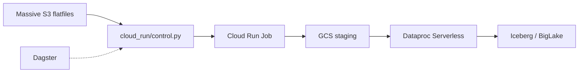

# Architecture

## Batch pipeline (this repo)

## Platform context

| Component | Repo |
|-----------|------|
| Real-time streaming (WebSocket, API) | [finpipe](https://github.com/gavinfancher/finpipe) |
| React dashboard | [finpipe-website](https://github.com/gavinfancher/finpipe-website) |
| Batch lakehouse (this repo) | equity-lakehouse |

Educational markdown about streaming lives in **finpipe-website** (`content/learn/`, `content/blog/`). Operational truth for batch is here in `for-agents/`.

## Pipeline stages

1. **Control** (`cloud_run/control.py`) — list S3 keys, write manifest, trigger Cloud Run Job.
2. **Copy** (`cloud_run/ingest/main.py`) — shard `.csv.gz` files to GCS with Hive-style paths.
3. **Commit** (`gcp-spark/`) — Dataproc Serverless PySpark into Iceberg via BigLake catalog.

See [data-model.md](data-model.md) and [infra.md](infra.md).
